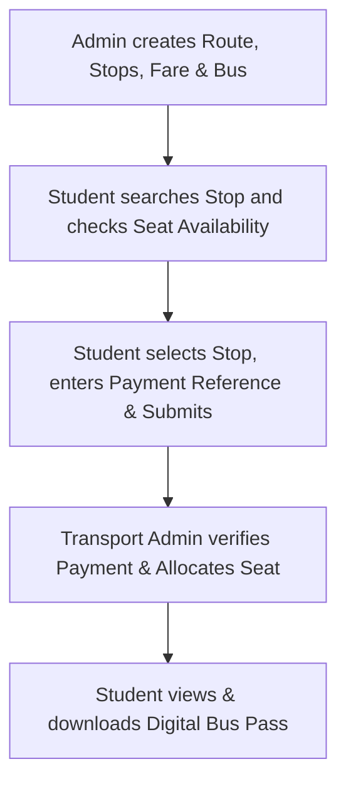
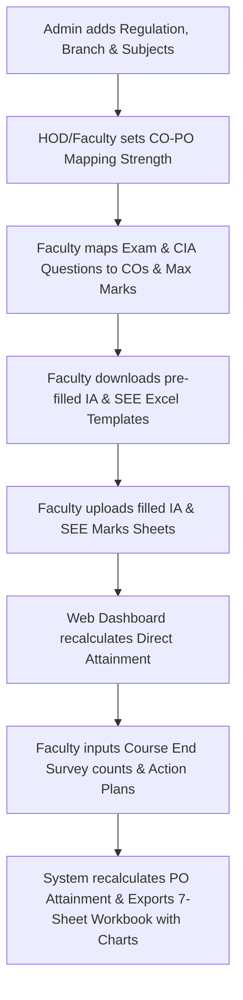
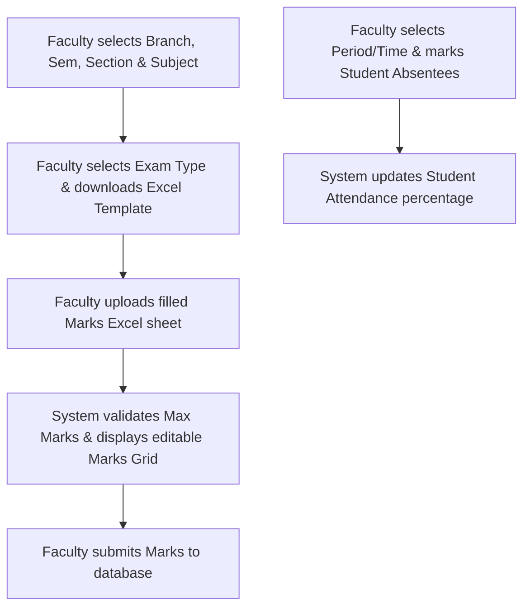
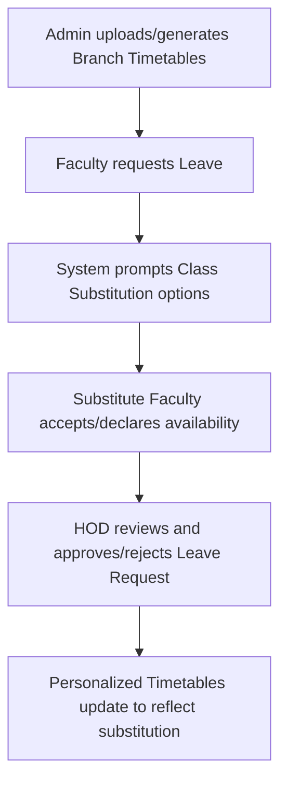
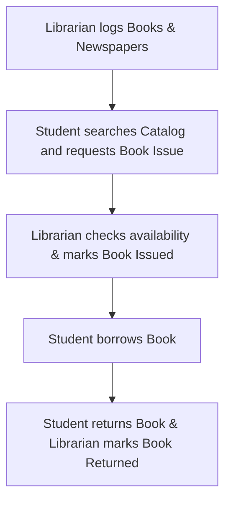
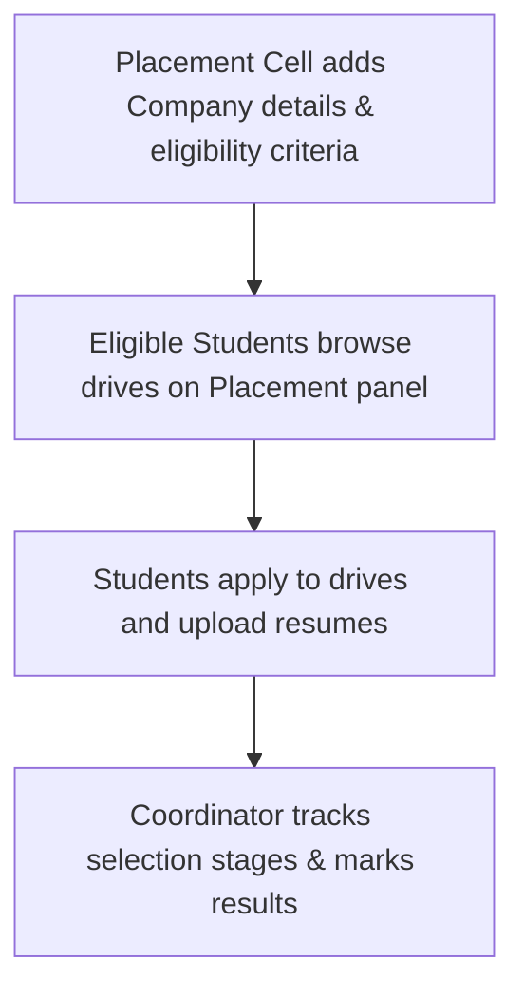

# ECAP_SPHN - Educational Campus Administration Portal

A premium, comprehensive, and responsive campus management system designed to streamline academic and administrative workflows. The portal is equipped with role-based access control, interactive visualization dashboards, and native report generation for Students, Faculty, HODs, Admins, Accounts, Library, and Transport teams.

---

## 🎨 Design Philosophy & User Experience

- **Glassmorphism & Rich Aesthetics**: Beautiful, Harmonious, HSL-tailored colors, smooth gradients, and sleek dark modes.
- **Vibrant Interactive Dashboards**: Built with dynamic animations (Framer Motion) and micro-interactions.
- **Mobile-First & Responsive Layout**: Optimized across Desktop, Tablet, and Mobile viewport grids.
- **Role-Based Workspaces**: Tailored user dashboards dynamically adapting layout and permissions based on JWT access tokens.

---

## 🚀 Modules & Features

### 🔐 1. Authentication & Security
- **Role-Based Access Control (RBAC)**: Secure routes and actions based on user roles (Admin, HOD, Faculty, Student, Accounts, Library, Transport).
- **JWT Authentication**: Secure token-based session management.
- **Alphanumeric Password Encryption**: Secure handling and password migration systems.

### 🚍 2. Transport Management
- **Route & Bus Configuration**: Register buses, define routes, stops, and dynamic location-based fare structures.
- **Seat Allocation & Availability Tracking**: Real-time capacity counting and seat verification.
- **Student Enrollment Hub**: Direct stop selection, seat reservation, and fee logging with payment references.
- **Digital Bus Pass**: Automated PDF/view generation of active student transport passes.

### 📊 3. OBE (Outcome-Based Education) & Attainment
- **CO-PO Mapping Matrix**: Set strength mappings (1: Weak, 2: Medium, 3: Strong) for Course Outcomes (COs) and Program Outcomes (POs/PSOs).
- **Exam Configuration**: Map exam questions (internals, externals, and assignments) to Course Outcomes (CO1-CO6) and set maximum marks.
- **Split Template Downloads**: Separate pre-populated student lists into IA (Internal Assessment) and SEE (Semester End Exam) Excel sheets.
- **Interactive Attainment Dashboard**: 
  - Dynamic recalculation of direct attainment (80%) and indirect attainment (20%).
  - Live recalculations of PO and overall attainment upon editing Course End Survey (CES) student ratings or manual indirect level overrides.
  - Interactive Attainment bar charts powered by Recharts.
- **Action Plans**: Direct input of targets, observations, gap analysis, CAYm1 action outcomes, and PO action plan details.
- **Multi-Sheet Report Generation**: Exporter compiles data, recalculates formula dependencies, and builds a comprehensive 7-sheet Excel workbook with native Excel charts.

### 🏢 4. Faculty & HOD Workspace
- **Personalized Timetables**: Dynamic scheduling with class substitution requests and approval flows.
- **Student Attendance Management**: Add, delete, and view attendance reports by date/subject, with automatic student percentage trackers.
- **Study Materials Hub**: File sharing system enabling faculty to upload notes, PDFs, links, and lecture materials for students.
- **Marks Management**: Pre-fill templates, import bulk marks from Excel, and manually override student marks.
- **Leave Application Management**: Request leaves, track approval status, and view historical leave requests.
- **HOD Dashboard**: Approval console for faculty leave requests, faculty listings, and departmental analytics.

### 💳 5. Accounts & Administration
- **Academic Setup**: Configure branches, semesters, regulations (e.g. R22, R18), and subject mappings.
- **Monthly Attendance Settings**: Configure working days, holidays, and attendance thresholds.
- **Notice Board System**: Global notice posting console visible across student and faculty dashboards.
- **Student & Faculty Registry**: Centralized control to register, update, and manage student profiles.

### 📚 6. Library System
- **Digital Cataloging**: Add, catalog, and track books and newspapers.
- **Issue & Return Tracking**: Integrated student checkout system with live borrow status and return dates.

### 💼 7. Placement Cell
- **Drive Management**: Configure placement drives with eligibility criteria, packages, job profiles, and interview rounds.
- **Student Placement Panel**: Apply to placement drives, view registration statuses, and track selection.

---

## 🛠 Tech Stack

- **Frontend**: React.js, Tailwind CSS (for modern layout control), Framer Motion (for animations), React Icons.
- **Backend**: Node.js, Express.js.
- **Database**: MongoDB with Mongoose ODM.
- **Excel Processor**: ExcelJS for generating complex calculations and native charts in exported sheets.

---

## 🔄 Module Workflows

### 🚍 Transport Module Workflow

### 📊 OBE & CO-PO Attainment Workflow

### 🏢 Attendance & Marks Workflow

### 🏢 Leave & Timetable Workflow

### 📚 Library Borrowing Workflow

### 💼 Placement Cell Workflow

---

**Developed by Laxmi Ganji**